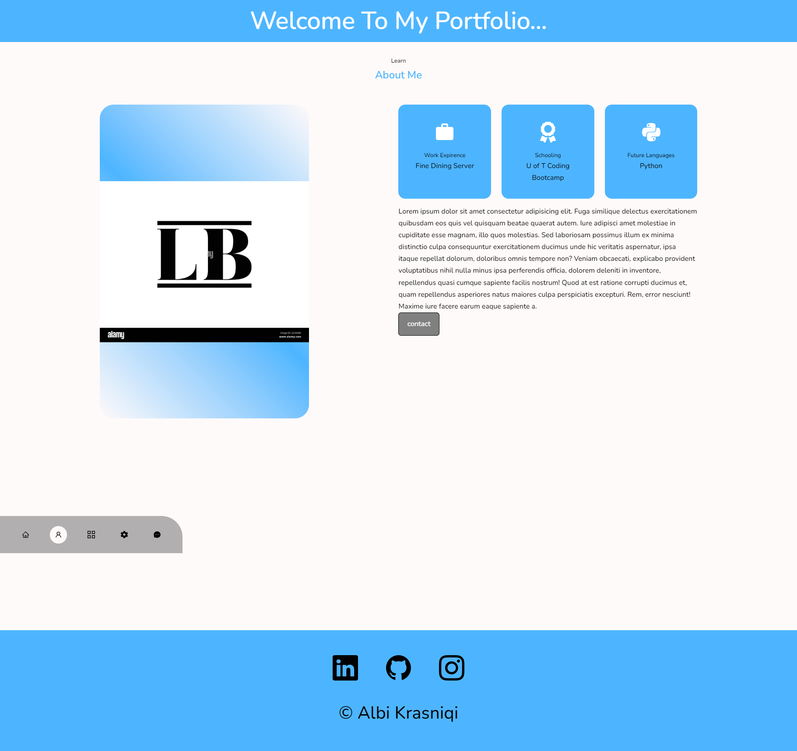

# reactPortfolio

## Badges

## Description

- Motivation: My motivation for this program was to create a react application that was going to be used as my portfolio for my future employees
- Goal: I built this project to see my understanding of react and to also create a portfolio for employers to look at and see my prospects to be a possible employee
- Problems Solved: It solves having employeers have a hard time finding my skills for there workplace
- What I Learned: i learned how display grid works and components in react, i also used css variabls for the first time and it made it much easier to change my styling overall i believe this project if anything enhanced my css knowleadge more then react becasue the react portion was much simpler and css can just go on forever.

## Installation

node.js

## Credits

N/A

## License

This program is done under the license: [MIT License](https://choosealicense.com/licenses/mit/)

## How To Contribute

## Questions

GitHub: https://github.com/Albikras?tab=repositories

If you want to reach me with additional question click my email link here: krasniqi1287@gmail.com

## Links

Gitpages: https://albikras.github.io/reactPortfolio/

## Screenshot

## video

https://github.com/Albikras/reactPortfolio/assets/124819029/ed09e300-c5c4-4cbe-bba1-c5c23193b17f

